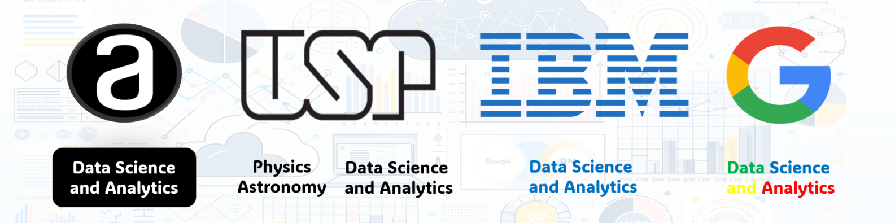

### Hi there 👋, I'm Diego de Mattos

### Welcome to My GitHub Profile!

### 💾 Repositories

- [Avengers Sentimental Analysis](https://github.com/diguitarrista/Avengers-Sentimental-Analysis-ML-Python)
  - Libraries: TextBlob, VADER, and RoBERTa.
- [Bitcoin EDA ML](https://github.com/diguitarrista/Bitcoin_historical-EDA-ML-Python)
  - Machine Learning: Neural Network: Long short-term memory
  - Libraries: Pandas, Yfinance, Matplotlib, Scikit-learn, Numpy, Tensor-Flow
  - Dashboard: BI
- [Carbon Emission EDA ML](https://github.com/diguitarrista/Carbon-Emission-EDA-ML-Python)
  - Machine Learning: Linear Regression, Random Forest, and GBM models.
  - Libraries: Pandas, Numpy, Matplotlib, Seaborn, Scikit-learn.
- [Dengue EDA ML](https://github.com/diguitarrista/Dengue-EDA-ML-Python)
  - Statistical Models: Poisson and Negative Binomial.
  - Libraries: Pandas, Numpy, Matplotlib, Statsmodels, Scipy.
- [DataSUS EDA Dashboard](https://github.com/diguitarrista/DataSUS-EDA-Python)
  - Libraries: Pandas, Numpy, Matplotlib, Dash, GeoPandas, Pyspark, SQLite3
  - Dashboards: Dash and BI
- [Exoplanets EDA ML](https://github.com/diguitarrista/Exoplanets-EDA-ML-Python)
  - Machine Learning: Random Forest.
  - Libraries: Pandas, Numpy, Matplotlib, Seaborn, Scikit-learn.
- [Netflix EDA](https://github.com/diguitarrista/Netflix-Titles-EDA-Python)
  - Libraries: Pandas, Matplotlib, Seaborn, Scikit-learn, TextBlob.
- [Python](https://github.com/diguitarrista/Python-Basics-Projects)
  - Python Basics and OOP.
- [Weather EDA ML](https://github.com/diguitarrista/Weather-EDA-ML-Python)
  - Machine Learning: Linear Regression (Box-Cox, Stepwise), PCA, Logistic Regression, Random Forest, XGBoost, Neural Network, K-fold.
  - Libraries: Pandas, Matplotlib, Seaborn, Factor_analyzer, Pingouin, Statsmodels, Scikit-learn, Scipy, Tensor-Flow.
  
### 🎓 Academic Background
- **MBA in Data Science and Analytics** from the University of São Paulo (2023 - 2024)
- **Bachelor's Degree in Physics** from the University of São Paulo (2012 - 2017)
- **Extension Courses** at the University of São Paulo:
  - Introduction to Computer Science with Python (Parts 1 & 2) (2021)
  - Big Data (2021)
  - Introduction to Machine Learning with Python (2023)
  - Fundamentals of Statistics, Introduction to R Software, and Machine Learning (2023)

### 💼 Professional Training
- **Google Data Analytics** (2022)
- **Preparing for Google Cloud Certification: Machine Learning Engineer** (2023)
- **IBM Data Science** (2023)

### 🛠 Skills & Expertise
- Fluent in **English**
- Proficient in **Python & R** for data analysis and visualization
- Experienced in **data exploration, cleaning, techniques, and engineering**
- Strong understanding of **statistical concepts and Machine Learning algorithms**
- Familiar with **data visualization tools** like Tableau, Power BI, and Matplotlib
- Excellent at **problem-solving** and working with large datasets using MySQL, MongoDB, Apache Airflow
- Effective **communication and collaboration** skills with cross-functional teams
- Quick learner, motivated by staying updated on the latest advances in **Data Science**

### 📚 Courses
### Alura
- **Beginning Programming Career & Education** (2019)
- **Front-end Formation and JavaScript Developer Career** (2019)
- **First Steps with Data Engineering** (2024)

### 📫 You Can Reach Me
- **LinkedIn:** [Diego de Mattos](https://www.linkedin.com/in/diego-de-mattos-166417167/)
- **Email:** diego.mattos.candido@alumni.usp.br
---

Thank you for visiting my profile! I'm passionate about unlocking the potential of data to solve complex problems and drive innovation. Feel free to reach out if you're interested in collaborating on projects or sharing insights.

