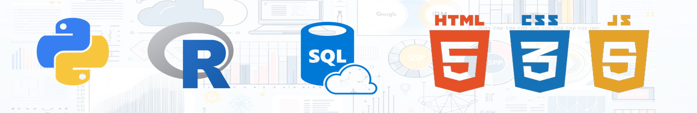

### Hi there 👋, I'm Diego de Mattos

### Welcome to My GitHub Profile!

### 💾 Repositories

- [Avengers Sentimental Analysis](https://github.com/diguitarrista/Avengers-Sentimental-Analysis-ML-Python)
  - Libraries: TextBlob, VADER, and RoBERTa.
- [Bitcoin EDA ML](https://github.com/diguitarrista/Bitcoin_historical-EDA-ML-Python)
  - Machine Learning: Neural Network: Long short-term memory
  - Libraries: Pandas, Yfinance, Matplotlib, Scikit-learn, Numpy, Tensor-Flow
  - Dashboard: BI
- [Carbon Emission EDA ML](https://github.com/diguitarrista/Carbon-Emission-EDA-ML-Python)
  - Machine Learning: Linear Regression, Random Forest, and GBM models.
  - Libraries: Pandas, Numpy, Matplotlib, Seaborn, Scikit-learn.
- [Dengue EDA ML](https://github.com/diguitarrista/Dengue-EDA-ML-Python)
  - Statistical Models: Poisson and Negative Binomial.
  - Libraries: Pandas, Numpy, Matplotlib, Statsmodels, Scipy.
- [DataSUS EDA Dashboard](https://github.com/diguitarrista/DataSUS-EDA-Python)
  - Libraries: Pandas, Numpy, Matplotlib, Dash, GeoPandas, Pyspark, SQLite3
  - Dashboards: Dash and BI
- [Exoplanets EDA ML](https://github.com/diguitarrista/Exoplanets-EDA-ML-Python)
  - Machine Learning: Random Forest.
  - Libraries: Pandas, Numpy, Matplotlib, Seaborn, Scikit-learn.
- [Netflix EDA](https://github.com/diguitarrista/Netflix-Titles-EDA-Python)
  - Libraries: Pandas, Matplotlib, Seaborn, Scikit-learn, TextBlob.
- [Python](https://github.com/diguitarrista/Python-Basics-Projects)
  - Python Basics and OOP.
- [Weather EDA ML](https://github.com/diguitarrista/Weather-EDA-ML-Python)
  - Machine Learning: Linear Regression (Box-Cox, Stepwise), PCA, Logistic Regression, Random Forest, XGBoost, Neural Network, K-fold.
  - Libraries: Pandas, Matplotlib, Seaborn, Factor_analyzer, Pingouin, Statsmodels, Scikit-learn, Scipy, Tensor-Flow.
  
### 🎓 Academic Background
- **MBA in Data Science and Analytics** from the University of São Paulo (2023 - 2024)
- **Bachelor's Degree in Physics** from the University of São Paulo (2012 - 2017)
- **Extension Courses** at the University of São Paulo:
  - Introduction to Computer Science with Python (Parts 1 & 2) (2021)
  - Big Data (2021)
  - Introduction to Machine Learning with Python (2023)
  - Fundamentals of Statistics, Introduction to R Software, and Machine Learning (2023)

### 💼 Professional Training
- **Google Data Analytics** (2022)
- **Preparing for Google Cloud Certification: Machine Learning Engineer** (2023)
- **IBM Data Science** (2023)

### 🛠 Skills & Expertise
- **Programming Languages**: Python, R, JavaScript, HTML, CSS;
- **Libraries**: Pandas, Numpy, Matplotlib, Seaborn, Dash Sklearn, Scipy, Statsmodel, TensorFlow
- **Big Data**: ETL/ELT Pipeline, MySQL, MongoDB, Apache Airflow;
- **Data Science**: Data Analysis, Data Mining, Data Cleaning, Data Wrangling, Data Viz: Tableau, Power BI;
- **Machine Learning**: Linear Regression, PCA, Factor Analysis, Clustering, Trees, Networks, Ensemble Models, Neural Networks, Text Mining, Sentiment Analysis, and NLP;
- **Extra**: Fluent English, Excel, Scrum, Analytics, and Risk Management.

### 📚 Courses
### Alura
- **Beginning Programming Career & Education** (2019)
- **Front-end Formation and JavaScript Developer Career** (2019)
- **First Steps with Data Engineering** (2024)
- **First Steps with SQL** (2024)
- **Data Science** (2024)

### 📫 You Can Reach Me
- **LinkedIn:** [Diego de Mattos](https://www.linkedin.com/in/diego-de-mattos-166417167/)
- **Email:** diego.mattos.candido@alumni.usp.br

---

Thank you for visiting my profile! I'm passionate about unlocking the potential of data to solve complex problems and drive innovation. Feel free to reach out if you're interested in collaborating on projects or sharing insights.

